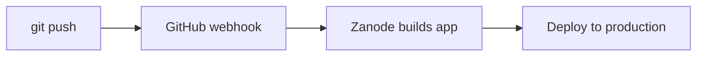

## How it works

When you connect a GitHub repository to Zanode, we automatically deploy your app whenever you push to your main branch.



## Automatic deploys

By default, every push to your **main** or **master** branch triggers a production deployment.

<Steps>
  <Step title="Push your code">
    ```bash
    git add .
    git commit -m "New feature"
    git push origin main
    ```
  </Step>
  <Step title="Build starts automatically">
    Zanode receives a webhook from GitHub and starts building your app.
  </Step>
  <Step title="Deploy completes">
    Once the build succeeds, your app is live within seconds.
  </Step>
</Steps>

## Preview deployments (coming soon)

<Info>
  Preview deployments for pull requests are on our roadmap and coming soon.
</Info>

Once available, pushing to any non-main branch will create a preview deployment with a unique URL like:
- `feature-new-header--your-project.zano.click`

## Manual redeploys

You can trigger a redeploy from the dashboard:

1. Go to your project
2. Click **Deploy** in the header

This is useful when:
- Environment variables have changed
- You want to rebuild without pushing code

## Build logs

View real-time build logs in your dashboard:

1. Go to your project → **Deployments**
2. Click on any deployment to see full logs

Logs include:
- Dependency installation (`npm install`)
- Build output (`npm run build`)
- Deployment status
